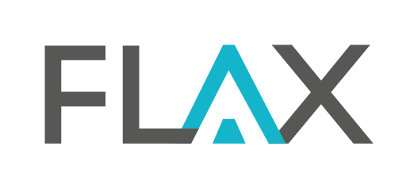

# SONiC Wedge100S — Layer-3 Routing Setup Guide

How to configure the dual-Wedge100S ToR complex for a 48-node Kubernetes cluster
with Calico BGP. Covers port breakout, BGP container enablement, config generation,
and ZTP deployment.

(verified on hardware 2026-03-30, SONiC hare-lorax, kernel 6.1.0-29-2-amd64)

---

## Background

The dual-Wedge100S L3 design uses eBGP-to-hosts: each k8s node runs Calico BGP
and advertises its pod CIDR (/24) to both switches. The switches exchange pod CIDRs
over an inter-switch BGP link so east-west traffic stays in-rack. A static default
route sends all other traffic toward the upstream provider. Calico `natOutgoing`
masquerades pod egress at the node NIC — no NAT on the switch.

See `docs/superpowers/specs/2026-03-30-l3-support-design.md` for the full design.

---

## Physical Port Assignment (per Wedge)

| Ports | Role |
|---|---|
| P1-4   (E0,4,8,12)    | Peer switch — inter-switch BGP link |
| P5-10  (E16-E36)      | Left/center nodes — 4×25G breakout |
| P11-12 (E40,E44)      | Storage / Yosemite v3 A/B |
| P13-20 (E48-E76)      | Reserved (peer-rack) |
| P21-22 (E80,E84)      | Storage / Yosemite v3 C/D |
| P23-28 (E88-E108)     | Right/center nodes — 4×25G breakout |
| P29-32 (E112-E124)    | Uplinks (P29/E112 + P30/E116 active) |

---

## Step 1 — Generate per-switch config_db.json files

On the development host, run the generator for each switch:

```bash
cd /export/sonic/sonic-buildimage.claude

# Wedge A
python3 device/accton/x86_64-accton_wedge100s_32x-r0/ztp/gen-l3-config.py \
    --switch a \
    --hostname wedge-a \
    --mac REPLACE-WITH-WEDGE-A-MAC \
    --mgmt-ip REPLACE-WITH-WEDGE-A-MGMT-IP/PREFIX \
    --mgmt-gw REPLACE-WITH-MGMT-GW \
    --uplink-ip REPLACE-WITH-WEDGE-A-UPLINK-IP/PREFIX \
    --uplink-gw REPLACE-WITH-UPSTREAM-GW \
    > /tmp/wedge-a_l3_config_db.json

# Wedge B
python3 device/accton/x86_64-accton_wedge100s_32x-r0/ztp/gen-l3-config.py \
    --switch b \
    --hostname wedge-b \
    --mac REPLACE-WITH-WEDGE-B-MAC \
    --mgmt-ip REPLACE-WITH-WEDGE-B-MGMT-IP/PREFIX \
    --mgmt-gw REPLACE-WITH-MGMT-GW \
    --uplink-ip REPLACE-WITH-WEDGE-B-UPLINK-IP/PREFIX \
    --uplink-gw REPLACE-WITH-UPSTREAM-GW \
    > /tmp/wedge-b_l3_config_db.json
```

Place both files on your ZTP HTTP server at the path configured in
`ztp/ztp-l3-sample.json`.

---

## Step 2 — Back up current config

```bash
ssh admin@<wedge-ip> 'sudo cp /etc/sonic/config_db.json /etc/sonic/config_db.json.pre-l3'
```

---

## Step 3 — Apply config and restart SONiC

```bash
scp /tmp/wedge-a_l3_config_db.json admin@<wedge-a-ip>:~/config_db.json
ssh admin@<wedge-a-ip> "sudo cp ~/config_db.json /etc/sonic/config_db.json && sudo systemctl restart sonic"
```

Wait 60 seconds. Repeat for Wedge B.

---

## Step 4 — Verify BGP container is running

```bash
ssh admin@<wedge-ip> "docker ps | grep bgp"
ssh admin@<wedge-ip> "docker exec bgp supervisorctl status"
```

Expected: `bgpd`, `bgpcfgd`, `zebra`, `fpmsyncd` all RUNNING.

---

## Step 5 — Verify routing table

```bash
ssh admin@<wedge-ip> "show bgp summary"
# Expect: router-id set, ASN correct, no established sessions yet (nodes not connected)

ssh admin@<wedge-ip> "show ip route static"
# Expect: S* 0.0.0.0/0 via <upstream-gw>

ssh admin@<wedge-ip> "show ip interface Loopback0"
# Expect: 10.1.0.1/32 (Wedge A) or 10.1.0.2/32 (Wedge B)
```

---

## Step 6 — Configure Calico on k8s nodes

On each k8s node, Calico must be configured to peer with both switches. Key settings:

```yaml
# IPPool — natOutgoing masquerades pod egress at the node NIC
apiVersion: projectcalico.org/v3
kind: IPPool
spec:
  cidr: 10.244.0.0/16
  blockSize: 24
  natOutgoing: true

# Disable node-to-node mesh — we use explicit BGPPeer resources
apiVersion: projectcalico.org/v3
kind: BGPConfiguration
metadata:
  name: default
spec:
  nodeToNodeMeshEnabled: false
  asNumber: 64512   # base ASN — each node overrides with its own (64511+n)
```

For each node n, create two BGPPeer resources pointing at both switches:

```yaml
# Peer toward Wedge A (10.0.n.0 on the node's /31 to Wedge A)
apiVersion: projectcalico.org/v3
kind: BGPPeer
spec:
  peerIP: 10.0.NODE_N.0
  asNumber: 65000
---
# Peer toward Wedge B
apiVersion: projectcalico.org/v3
kind: BGPPeer
spec:
  peerIP: 10.0.NODE_N.2
  asNumber: 65001
```

---

## Step 7 — Verify BGP sessions after node connectivity

Once nodes are cabled and Calico is running:

```bash
# All 48 node sessions + inter-switch + optional upstream = Established
ssh admin@<wedge-ip> "show bgp summary"

# 48 pod /24 CIDRs learned from nodes
ssh admin@<wedge-ip> "show ip route bgp"

# Cross-switch reachability (node on Wedge B visible from Wedge A)
ssh admin@wedge-a "sudo ip vrf exec default ping -c 3 10.0.48.1"
```

---

## Upgrading to Case A (full BGP upstream)

When your upstream router supports BGP — two changes only:

1. In the generated config, replace `STATIC_ROUTE 0.0.0.0/0` with a `BGP_NEIGHBOR`
   entry for the upstream (already stubbed in the template).
2. Set `natOutgoing: false` on the Calico IPPool.

Re-generate both per-switch config_db.json files and apply. All node and
inter-switch BGP sessions are unaffected.
